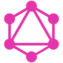
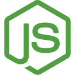
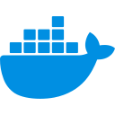

  

### Hi 👋, I'm Andrii Holovkov
Senior Frontend Developer specializing in React, Next.js, and TypeScript with 5+ years of experience building scalable B2B SaaS products across FinTech, E-commerce, PropTech, AgriTech, and Fitness.

I enjoy turning complex business requirements into intuitive, high-performance products. Combining a strong engineering mindset with a background in UI/UX design, I build maintainable architectures, scalable design systems, and data-intensive applications with a focus on performance, accessibility, and developer experience.

**Resume:** [View / Download PDF](https://drive.google.com/drive/folders/17B2nWxINUK--JrJUjz4LN8dtNp__NFgP?usp=sharing)

### Connect with me: 
👉 Open to new opportunities — feel free to reach out.  
👉 Interested in full-time remote opportunities.

- LinkedIn - https://www.linkedin.com/in/holovkov (primary contact)
- Telegram - https://t.me/andrii_holovkov
- Email - andriiholovkov@gmail.com
- GitHub - https://github.com/andriiholovkov
- Portfolio - https://andrii-holovkov.vercel.app

### Tech Stack:

<table>
<tr>
<td align="center" width="10%">
 
React
</td>
<td align="center" width="10%">
 
Next.js
</td>
<td align="center" width="10%">
 
TypeScript
</td>
<td align="center" width="10%">
 
JavaScript
</td>
<td align="center" width="10%">
 
Claude&nbsp;Code
</td>
<td align="center" width="10%">
 
TanStack&nbsp;Query
</td>
<td align="center" width="10%">
 
GraphQL
</td>
<td align="center" width="10%">
 
Zustand
</td>
<td align="center" width="10%">
 
Redux&nbsp;Toolkit
</td>
<td align="center" width="10%">
 
Refine
</td>
</tr>
<tr></tr>
<tr>
<td align="center" width="10%">
 
Firebase
</td>
<td align="center" width="10%">
 
Zod
</td>
<td align="center" width="10%">
 
Vite
</td>
<td align="center" width="10%">
 
Vitest
</td>
<td align="center" width="10%">
 
Jest
</td>
<td align="center" width="10%">
 
Tailwind
</td>
<td align="center" width="10%">
 
shadcn/ui
</td>
<td align="center" width="10%">
 
HTML5
</td>
<td align="center" width="10%">
 
CSS3
</td>
<td align="center" width="10%">
 
SCSS
</td>
</tr>
<tr></tr>
<tr>
<td align="center" width="10%">
 
Material&nbsp;UI
</td>
<td align="center" width="10%">
 
Mantine
</td>
<td align="center" width="10%">
 
Storybook
</td>
<td align="center" width="10%">
 
GSAP
</td>
<td align="center" width="10%">
 
Motion
</td>
<td align="center" width="10%">
 
Node.js
</td>
<td align="center" width="10%">
 
NestJS
</td>
<td align="center" width="10%">
 
PostgreSQL
</td>
<td align="center" width="10%">
 
Drizzle
</td>
<td align="center" width="10%">
 
Docker
</td>
</tr>
</table>
